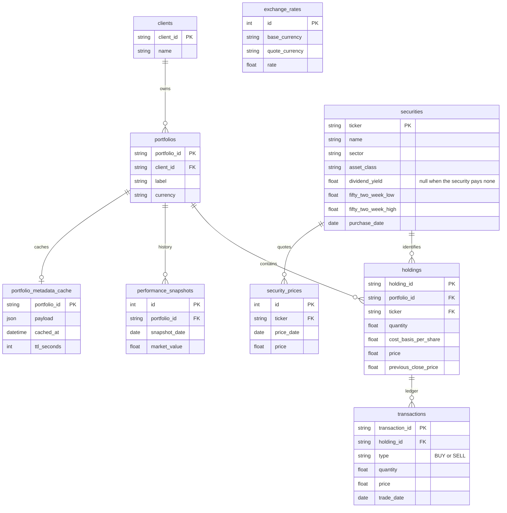

# Portfolio database

SQLite file: `backend/solution/data/portfolio.db`, created and seeded on startup through SQLAlchemy. The platform base currency is CAD.

## How later endpoints use the tables

| Operation | Tables |
| --- | --- |
| Portfolio metadata and CRM cache | `portfolios`, `portfolio_metadata_cache` |
| Holdings, allocation, household totals | `clients`, `portfolios`, `holdings`, `securities` |
| Performance history | `performance_snapshots` |
| Currency display | `exchange_rates` (`CAD→CAD` is 1, `CAD→USD` is the fixture rate 0.73) |
| Holding detail | `securities`, `security_prices` |
| Ledger replay | `transactions` for one `holding_id` |

`market_value`, `weight_percent`, gain/loss, day change, and allocation `value` / `percent` are calculated when a request is served. They are not columns. Allocation groups holdings by `securities.asset_class` in `holding_id` order.

## Snapshot inputs and the ledger

`holdings.quantity` and `holdings.cost_basis_per_share` are the seed snapshot for the holdings and allocation endpoints. A closed position keeps the historical cost from the fixture (`ZERO` is quantity 0, cost 10).

Ledger replay reads `transactions` ordered by `trade_date` and returns current quantity and average cost in memory. That result is not written back onto `holdings`. `seed.json` `ledgerCases` (oversell and out-of-order samples) stay in the fixture file for the replay tests; they are not portfolio rows.

`previous_close_price` may be 0 (`NEW`). A transaction quantity must be greater than 0, and `type` must be `BUY` or `SELL`.

## Assumptions

- One portfolio holds each ticker at most once. The same ticker may appear in another portfolio (`AAPL` is in `P-9001` and `P-SINGLE`), so reference data lives on `securities` and the position quote lives on `holdings`.
- `securities.purchase_date` follows the fixture, which keys that date by ticker. The earliest `BUY` on a holding is available when a per-position open date is needed.
- `trade_date` is the requirement's transaction `date`.
- Cache freshness is `cached_at + ttl_seconds`. `stale` is decided when the metadata endpoint reads the row.
- Performance rows prefer `backend/fixtures/performance-history.json` when that file exists. Otherwise startup builds the same lengths as `generate-history.mjs`: 401, 60, 0, and 60 daily points ending today (UTC) for `P-9001`, `P-9002`, `P-EMPTY`, and `P-SINGLE`.
